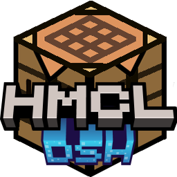

<div align="center">
    
</div>

<h1 align="center">Hello DeepSeek! Launcher</h1>

<div align="center">

[](https://github.com/MCXCC303/HDSL/actions/workflows/build.yml)
[](LICENSE)
[](https://www.kernel.org)
[](https://openjdk.org/projects/jdk/21)

</div>
<div align="center">
最原汁原味的体验！
</div>

---

## 简介

HDSL 是一款 [DeepSeek Harness](https://github.com/deepseek-ai/deepseek-harness)（`dsh`）的启动器与版本管理器，使用 [HMCL](https://github.com/HMCL-dev/HMCL) 的 JavaFX 外观层构建。

DeepSeek Harness 通过 npm 发布、以 `dsh web` 启动。HDSL 把这些步骤收进一个图形界面：下载并安装任意已发布的 `dsh` 版本、为每个实例保留独立的运行环境与 `DSH_HOME`、管理插件、查看会话与运行日志，并在同一个窗口里启动和停止它们。


## 启动策略

目前 HDSL 通过高度定制化启动策略，支持启动各种 DSH 版本，从最古老的 v0.0.1-rc1 到最新的 v0.1.7-rc.1。

HDSL 致力于提供与 HMCL 类似的高质量、高兼容性、用户友好的使用体验，无论是新手小白还是开发人员，HDSL 都能发挥出色的体验。


## 整合包

HDSL v0.2.0 现已支持 [PackForge](https://github.com/DSH-PackForge/DSH-PackForge) 协议整合包导出，你可以通过 HDSL 在 [PackMarket](https://github.com/DSH-PackForge/dsh-pack-market) 中搜索、下载并安装公开发布在市场中的 DSH 整合包：


当然，自己动手制作一个整合包也不在话下。


## 插件

HDSL v0.2.0 支持从 NPM 源安装指定插件，同样也支持从本地安装插件。

HDSL 的插件管理与 HMCL 操作逻辑高度一致，为玩家提供最原汁原味的体验。


## 账户

HDSL v0.2.0 复刻了来自 HMCL 的皮肤与账户系统，并融入了独特的操作逻辑，让你的 DSH 更加多样！

## 环境要求

| 项目 | 要求 |
|---|---|
| 操作系统 | **Linux / macOS**（x86_64 / aarch64） |
| 运行时 | **Java 21**（构建与运行） |
| DeepSeek Harness | **Node.js `^22.19.0 \|\| >=24.0.0`**，以及用于插件管理的 **pnpm** |

## 构建

```bash
./gradlew build      # 编译并运行测试
./gradlew run        # 直接启动
```

打包为 `.deb` 与自解压脚本（Linux）：

```bash
./gradlew makeDeb
```

打包为 `.app`、`.dmg` 与 `.zip`（macOS）：

```bash
./gradlew makeExecutable
./packaging/mac-packages.sh <版本> build/libs/hdsl-<版本>.sh src/main/resources/assets/img/icon@8x.png build/libs
```

## 参与贡献

HDSL 是 HMCL 的衍生作品，目前功能正在快速完善，欢迎通过该仓库提交问题与改进。

## 开源协议

本作品是 **Hello Minecraft! Launcher** 的衍生作品，整体遵循 [GPLv3](https://www.gnu.org/licenses/gpl-3.0.html) 开源协议，同时附有以下附加条款。

### 附加条款（依据 GPLv3 开源协议第七条）

1. 当你分发该程序的修改版本时，你必须以一种合理的方式修改该程序的名称或版本号，以示其与原始版本不同。（依据 [GPLv3, 7(c)](https://github.com/HMCL-dev/HMCL/blob/11820e31a85d8989e41d97476712b07e7094b190/LICENSE#L372-L374)）

   本作品的名称已改为 **Hello DeepSeek! Launcher（HDSL）**，版本号见 `build.gradle.kts`。

2. 你不得移除该程序所显示的版权声明。（依据 [GPLv3, 7(b)](https://github.com/HMCL-dev/HMCL/blob/11820e31a85d8989e41d97476712b07e7094b190/LICENSE#L368-L370)）

   原始版权声明与源码文件头的版权信息完整保留，见 [`NOTICE`](NOTICE)。

界面层的说法与实现来自 HMCL 及其贡献者；DeepSeek Harness 领域层为 HDSL 原创。

## 致谢
Bemly (Bemly_, For MacOS Transplanting)

DeepSeek V4.1 Flash

